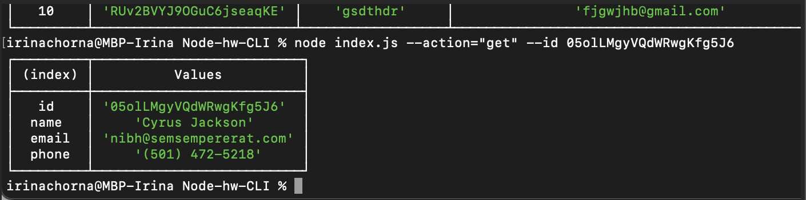
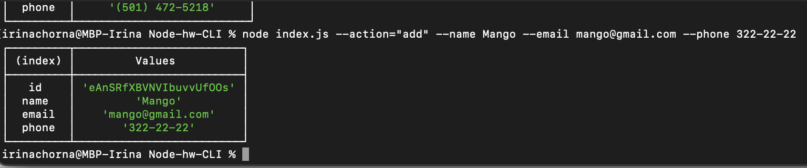
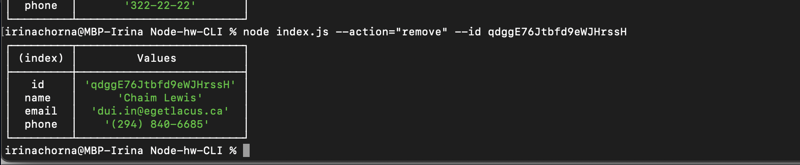
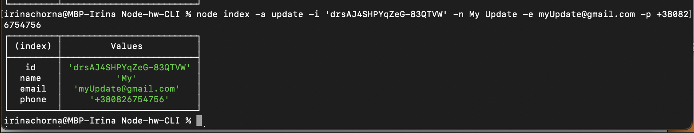
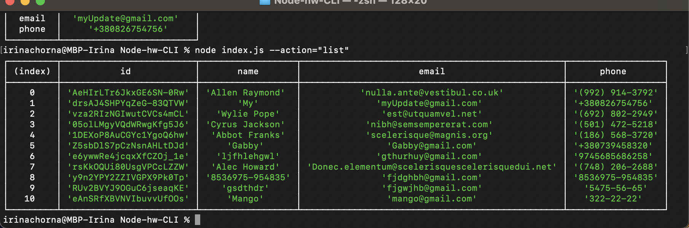

Все виводжу в таблицю  (console.table)!
#Отримуємо і виводимо весь список контактів у вигляді таблиці
Команда: node index.js --action="list"

# Отримуємо контакт по id
Команда: node index.js --action="get" --id 05olLMgyVQdWRwgKfg5J6

# Додаємо контакт
Команда: node index.js --action="add" --name Mango --email mango@gmail.com --phone 322-22-22

# Видаляємо контакт
Команда: node index.js --action="remove" --id qdggE76Jtbfd9eWJHrssH

# Редагуємо контакт
Команда: node index -a update -i 'drsAJ4SHPYqZeG-83QTVW' -n My Update -e myUpdate@gmail.com -p +380826754756

# Контрольний раз отримуємо і виводимо весь список контактів у вигляді таблиці
Команда: node index.js --action="list"

